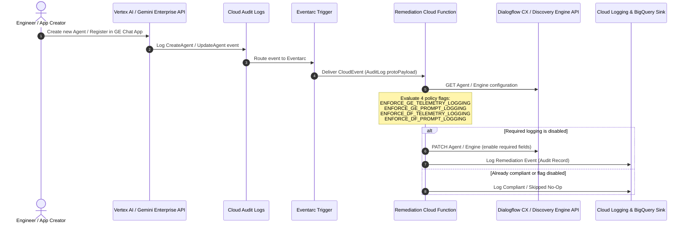

# Automated Agent Audit Logging & Observability Enforcer

[](LICENSE)
[](#2-solution-overview--architecture)
[](#5-deployment-guide)
[](#6-testing--validation)

> **Event-driven automated remediation pipeline (Eventarc + Cloud Functions Gen 2) to enforce OpenTelemetry tracing and prompt/response interaction logging across all agents in Gemini Enterprise and Dialogflow CX / Vertex AI Agent Platform.**

---

## 1. Problem & Regulatory Context

### The Challenge: Silent Compliance Drift in GenAI Deployments
When engineers deploy or register conversational agents and generative AI applications—whether via the Google Cloud Console, ADK (Agent Development Kit), or REST APIs—observability and prompt-logging settings are frequently left at their default, disabled states. 

In enterprise environments, this creates immediate regulatory and security exposure:
* **No Record of User Prompts or Model Completions**: Without interaction logging, there is no audit trail of what users asked or what sensitive or regulated data was generated.
* **No Distributed Telemetry**: Without OpenTelemetry tracing enabled, tool calls, vector search queries, data connectors, and reasoning steps cannot be monitored or audited for debugging and forensic review.
* **Console & Manual Drift**: Even if agents are created compliant via Infrastructure-as-Code (IaC), developers can inadvertently disable logging via the web console or ad-hoc API updates.

### Regulatory Drivers
Enterprises operating under strict regulatory frameworks require immutable record-keeping and observability for AI systems:
* **SEC Rule 17a-4 & FINRA 4511**: Mandatory retention and tamper-proof auditing of all electronic communications, client interactions, and automated AI advisory prompts/responses.
* **EU AI Act & GDPR**: Transparency, traceability of AI decisions, accountability, and user data subject auditing across generative AI pipelines.
* **DORA (Digital Operational Resilience Act)**: Comprehensive operational logging, incident detection, and third-party AI risk management.
* **FedRAMP & HIPAA**: Stringent access auditing, least-privilege logging, and traceability of protected health information (PHI) or government workload queries.

---

## 2. Solution Overview & Architecture

This repository delivers a zero-touch, event-driven automated remediation pipeline that guarantees continuous compliance:

1. **Interception**: **Eventarc** listens to Cloud Audit Logs (`cloudaudit.googleapis.com`) for all agent creation and update events in **Gemini Enterprise (Discovery Engine)** and **Dialogflow CX / Vertex AI Agent Platform** (across both global and regional endpoints, including Console-generated `v1main` events).
2. **Serverless Evaluation**: Eventarc routes CloudEvents to a Gen 2 **Cloud Function** executing under a least-privilege service account.
3. **Policy Inspection**: The function inspects the agent's configuration and evaluates four independent policy toggles.
4. **Automated Remediation**: If required logging is disabled, the function **automatically patches the agent via the Google Cloud API** in real time (< 5 seconds) and writes a structured audit log entry to Cloud Logging.
5. **Idempotent & Safe**: If an agent already meets the policy, the function logs `ALREADY_COMPLIANT` and performs no unnecessary write operations.

### Architecture Sequence Diagram



---

## 3. Policy Controls & Feature Flags

You can independently toggle **Telemetry Logging** and **Prompt Logging** for **Gemini Enterprise** and **Dialogflow CX** via environment variables or Terraform variables:

| Platform | Capability | Env Var (`cloud_function`) | Terraform Variable (`terraform`) | Target API Proto Field | Default |
| :--- | :--- | :--- | :--- | :--- | :---: |
| **Gemini Enterprise** | **Telemetry Logging** | `ENFORCE_GE_TELEMETRY_LOGGING` | `enforce_ge_telemetry_logging` | `observability_config.observability_enabled` (+ linked agent `enable_stackdriver_logging`) | `true` |
| **Gemini Enterprise** | **Prompt Logging** | `ENFORCE_GE_PROMPT_LOGGING` | `enforce_ge_prompt_logging` | `observability_config.sensitive_logging_enabled` (+ linked agent `enable_interaction_logging`) | `true` |
| **Dialogflow CX** | **Telemetry Logging** | `ENFORCE_DF_TELEMETRY_LOGGING` | `enforce_df_telemetry_logging` | `advanced_settings.logging_settings.enable_stackdriver_logging` | `true` |
| **Dialogflow CX** | **Prompt Logging** | `ENFORCE_DF_PROMPT_LOGGING` | `enforce_df_prompt_logging` | `advanced_settings.logging_settings.enable_interaction_logging` | `true` |

---

## 4. Prerequisites & Requirements

Before deploying, ensure you have the following installed and configured:

* **Google Cloud CLI (`gcloud`)** initialized and authenticated (`gcloud auth login`).
* **Terraform >= 1.5.0** (if using Terraform for deployment).
* **Python 3.10+** (for local unit testing or running the integration suite).
* **Google Cloud Project** with billing enabled and the following APIs activated:
  * `cloudfunctions.googleapis.com` (Cloud Functions Gen 2)
  * `eventarc.googleapis.com` (Eventarc API)
  * `run.googleapis.com` (Cloud Run API)
  * `discoveryengine.googleapis.com` (Gemini Enterprise / Discovery Engine API)
  * `dialogflow.googleapis.com` (Dialogflow CX API)
  * `logging.googleapis.com` (Cloud Logging API)
* **IAM Permissions**:
  * Deployment requires `roles/editor` or granular permissions to create Cloud Functions, Eventarc triggers, and IAM bindings.
  * The Cloud Function runtime service account requires `roles/discoveryengine.editor` and `roles/dialogflow.admin` (automatically provisioned by the Terraform module).

---

## 5. Deployment Guide

### Option A: Using Terraform (Recommended for Production IaC)

The Terraform module provisions the Gen 2 Cloud Function, least-privilege IAM service account, Cloud Storage source bucket, and all Eventarc triggers (global and regional).

1. **Navigate to the Terraform directory**:
   ```bash
   cd terraform
   ```

2. **Configure your variables**:
   ```bash
   cp terraform.tfvars.example terraform.tfvars
   ```
   Edit `terraform.tfvars` with your project ID, region, and policy toggles:
   ```hcl
   project_id    = "your-gcp-project-id"
   region        = "us-central1"
   function_name = "agent-audit-logging-remediator"

   # Gemini Enterprise (Discovery Engine) logging enforcement toggles
   enforce_ge_telemetry_logging = true
   enforce_ge_prompt_logging    = true

   # Dialogflow CX logging enforcement toggles
   enforce_df_telemetry_logging = true
   enforce_df_prompt_logging    = true
   ```

3. **Initialize and apply**:
   ```bash
   terraform init
   terraform plan -out=tfplan
   terraform apply tfplan
   ```

### Option B: Using the `gcloud` Deployment Script

For rapid setup or testing without Terraform:
```bash
ENFORCE_GE_TELEMETRY_LOGGING=true \
ENFORCE_GE_PROMPT_LOGGING=true \
ENFORCE_DF_TELEMETRY_LOGGING=true \
ENFORCE_DF_PROMPT_LOGGING=false \
./scripts/deploy.sh <YOUR_PROJECT_ID> <REGION>
```

---

## 6. Testing & Validation

### 1. Unit Tests (Isolated Mock Suite)
Run unit tests to verify all 4 toggle permutations, event parsing, and API patch payload generation without calling Google Cloud APIs:
```bash
./scripts/test_local.sh
```
*15/15 unit tests pass in ~1s.*

### 2. End-to-End Integration Test Suite
The integration test suite validates the live remediation loop against real Google Cloud infrastructure:
* **Test Agent Setup (`test_00`)**: Verifies the Hello World ADK test agent source (`test_agent/app/agent.py`) and its deployed Reasoning Engine readiness.
* **Infrastructure Health (`test_01`)**: Verifies Cloud Function Gen 2 and all Eventarc triggers are active.
* **Agent Registration (`test_02`)**: Registers a new agent in Gemini Enterprise App with logging disabled and verifies Eventarc triggers remediation within seconds.
* **Drift Remediation (`test_03`)**: Tests drift detection and restoration on existing registered agents.
* **Cloud Logging Audit (`test_04`)**: Validates structured audit records in Cloud Logging.
* **Idempotency & Flags (`test_05`)**: Verifies idempotency (`ALREADY_COMPLIANT`) and policy flag isolation.

```bash
# Run the complete integration test suite
./run_integration_tests.sh

# Run only test agent setup check
./run_integration_tests.sh --setup

# Deploy/update the Hello World ADK test agent on Vertex AI Agent Runtime
./run_integration_tests.sh --deploy-agent

# Deploy or refresh remediation infrastructure before running tests
./run_integration_tests.sh --deploy
```

---

## 7. Directory Structure

```
agent-audit-logging-enforcer/
├── README.md                      # Architecture and operational documentation
├── LICENSE                        # Apache 2.0 open-source license
├── pytest.ini                     # Pytest test configuration and path resolution
├── run_integration_tests.sh       # Executable wrapper for the integration test runner
├── cloud_function/                # Cloud Function (Gen 2) remediation engine
│   ├── main.py                    # Entrypoint handling CloudEvents & fallback HTTP
│   ├── remediator.py              # Core logic inspecting & patching agent logging
│   ├── requirements.txt           # Cloud Function dependencies
│   └── test_remediator.py         # Unit tests verifying all 4 toggle flags
├── test_agent/                    # Hello World ADK Agent codebase for integration testing
│   ├── app/
│   │   ├── agent.py               # ADK agent implementation (Gemini model + tools)
│   │   ├── fast_api_app.py        # FastAPI server & endpoints
│   │   └── app_utils/             # A2A protocol and reasoning engine adapter
│   ├── agents-cli-manifest.yaml   # Agent manifest configuration
│   ├── deployment_metadata.json.example # Sample Reasoning Engine resource metadata
│   ├── pyproject.toml             # Agent dependencies (Google ADK, FastAPI, Uvicorn)
│   └── Dockerfile                 # Agent container definition
├── tests/                         # Integration test suite
│   ├── __init__.py
│   └── integration/
│       ├── __init__.py
│       ├── conftest.py            # Pytest fixtures and dynamic project discovery
│       ├── test_00_test_agent_setup.py             # ADK test agent source & RE readiness
│       ├── test_01_deployment_and_triggers.py      # Cloud Function & Eventarc health
│       ├── test_02_ge_agent_registration_e2e.py    # Agent registration Eventarc flow
│       ├── test_03_ge_agent_update_e2e.py          # Existing agent drift remediation
│       ├── test_04_cloud_logging_audit.py          # Cloud Logging audit record checks
│       └── test_05_idempotency_and_policy_flags.py # Idempotency and flag isolation
├── terraform/                     # Production Terraform deployment
│   ├── main.tf                    # Eventarc triggers, Cloud Function, IAM, Storage
│   ├── variables.tf               # Configurable project, region, and 4 policy flags
│   ├── outputs.tf                 # Output endpoints and IDs
│   ├── terraform.tfvars.example   # Sample variable definitions
│   └── versions.tf                # Provider version requirements
└── scripts/                       # Deployment and verification scripts
    ├── deploy.sh                  # Automated deployment via gcloud CLI
    ├── deploy_test_agent.sh       # Deploys test ADK agent to Vertex AI Agent Runtime
    ├── test_local.sh              # Local unit test runner
    ├── run_integration_tests.sh   # Live end-to-end integration test runner
    └── send_mock_event.py         # Mock CloudEvent delivery simulator
```

---

## 8. Security & Compliance Best Practices

* **Least Privilege IAM**: The Cloud Function runtime service account is granted only `roles/discoveryengine.editor` and `roles/dialogflow.admin`. It does not require broad project editor access.
* **Audit Trail Immutability**: All remediation actions generate structured logs written to Cloud Logging. For tamper-proof long-term retention (e.g. SEC Rule 17a-4), configure a Cloud Logging Sink routing to a locked Cloud Storage bucket (Object Retention Lock) or BigQuery.
* **Zero Secret Storage**: Uses Application Default Credentials (ADC) and Google-managed identity tokens; no service account keys or static credentials are required or stored.
* **Idempotency & Circuit Breaking**: The remediator performs conditional updates; if an agent is already compliant, no mutation occurs, preventing recursive Eventarc triggers.

---

## 9. License

This project is licensed under the [Apache License 2.0](LICENSE).
