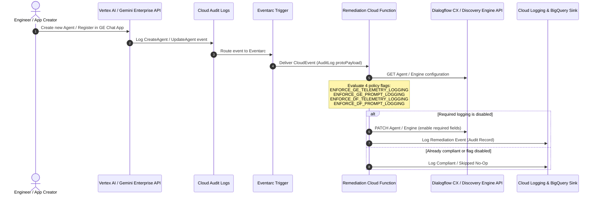

# Automated Agent Audit Logging & Observability Enforcer

> **Event-driven automated remediation pipeline (Eventarc + Cloud Functions Gen 2) to enforce OpenTelemetry tracing and prompt/response interaction logging across all agents in Gemini Enterprise and Dialogflow CX / Vertex AI Agent Platform.**

---

## 1. Feature Flags (4 Independent Toggles)

You can independently toggle **Telemetry Logging** and **Prompt Logging** for **Gemini Enterprise** and **Dialogflow CX** via environment variables or Terraform variables:

| Platform | Capability | Env Var (`cloud_function`) | Terraform Variable (`terraform`) | Target API Proto Field | Default |
| :--- | :--- | :--- | :--- | :--- | :---: |
| **Gemini Enterprise** | **Telemetry Logging** | `ENFORCE_GE_TELEMETRY_LOGGING` | `enforce_ge_telemetry_logging` | `observability_config.observability_enabled` (+ linked agent `enable_stackdriver_logging`) | `true` |
| **Gemini Enterprise** | **Prompt Logging** | `ENFORCE_GE_PROMPT_LOGGING` | `enforce_ge_prompt_logging` | `observability_config.sensitive_logging_enabled` (+ linked agent `enable_interaction_logging`) | `true` |
| **Dialogflow CX** | **Telemetry Logging** | `ENFORCE_DF_TELEMETRY_LOGGING` | `enforce_df_telemetry_logging` | `advanced_settings.logging_settings.enable_stackdriver_logging` | `true` |
| **Dialogflow CX** | **Prompt Logging** | `ENFORCE_DF_PROMPT_LOGGING` | `enforce_df_prompt_logging` | `advanced_settings.logging_settings.enable_interaction_logging` | `true` |

---

## 2. Problem & Regulatory Context

In regulated industries (Financial Services, Healthcare, Public Sector, Insurance), enterprises operating under regulatory frameworks (such as **FINRA, SEC, DORA, GDPR, and FedRAMP**) have strict compliance mandates for AI systems:
* **Auditability**: Every prompt input submitted by a user and every generated response output from an LLM/agent must be captured in an immutable audit trail.
* **Observability**: Execution traces and spans must be emitted to verify tool calls, data connectors, and reasoning flows.

### The Solution
This repository provides an automated, event-driven remediation pattern:
1. **Eventarc** intercepts Cloud Audit Log events whenever an agent or engine is created or updated in **Gemini Enterprise (Discovery Engine)** or **Dialogflow CX / Vertex AI Agent Platform**.
2. An event triggers a serverless **Cloud Function (Generation 2)** running under a least-privilege service account.
3. The function evaluates the 4 toggle flags and inspects the resource's logging settings.
4. If a required setting is disabled, the function **automatically patches the agent/engine via the Google Cloud API** to enable the required logging fields and emits a structured audit record.

---

## 3. Architecture Diagram



---

## 4. Directory Structure

```
agent-audit-logging-enforcer/
├── README.md                      # Architecture and operational documentation
├── cloud_function/                # Cloud Function (Gen 2) source code
│   ├── main.py                    # Entrypoint handling CloudEvents & fallback HTTP
│   ├── remediator.py              # Core logic inspecting & patching agent logging
│   ├── requirements.txt           # Python dependencies
│   └── test_remediator.py         # Unit tests verifying all 4 toggle flags
├── test_agent/                    # Hello World ADK Agent codebase for integration testing
│   ├── app/
│   │   ├── agent.py               # ADK agent implementation (Gemini model + tools)
│   │   ├── fast_api_app.py        # FastAPI server & endpoints
│   │   └── app_utils/             # A2A protocol and reasoning engine adapter
│   ├── agents-cli-manifest.yaml   # Agent manifest configuration
│   ├── deployment_metadata.json   # Deployed Reasoning Engine resource metadata
│   ├── pyproject.toml             # Agent dependencies (Google ADK, FastAPI, Uvicorn)
│   └── Dockerfile                 # Agent container definition
├── tests/                         # Integration test suite
│   ├── __init__.py
│   └── integration/
│       ├── __init__.py
│       ├── conftest.py            # Pytest fixtures and GE test client
│       ├── test_00_test_agent_setup.py             # ADK test agent source & RE readiness
│       ├── test_01_deployment_and_triggers.py      # Cloud Function & Eventarc health
│       ├── test_02_ge_agent_registration_e2e.py    # Agent registration Eventarc flow
│       ├── test_03_ge_agent_update_e2e.py          # Existing agent drift remediation
│       ├── test_04_cloud_logging_audit.py          # Cloud Logging audit record checks
│       └── test_05_idempotency_and_policy_flags.py # Idempotency and flag isolation
├── terraform/                     # Production Terraform deployment
│   ├── main.tf                    # Eventarc triggers, Cloud Function, IAM, Storage
│   ├── variables.tf               # Configurable project, region, and 4 policy flags
│   ├── outputs.tf                 # Output endpoints and IDs
│   ├── terraform.tfvars.example   # Sample variable definitions
│   └── versions.tf                # Provider version requirements
└── scripts/                       # Deployment and verification scripts
    ├── deploy.sh                  # Automated deployment via gcloud CLI
    ├── deploy_test_agent.sh       # Deploys test ADK agent to Vertex AI Agent Runtime
    ├── test_local.sh              # Local unit test runner
    ├── run_integration_tests.sh   # Live end-to-end integration test runner
    └── send_mock_event.py         # Mock CloudEvent delivery simulator
```

---

## 5. Deployment

### Option A: Using Terraform (Recommended for Enterprise IaC)

1. **Navigate to the Terraform directory**:
   ```bash
   cd terraform
   ```

2. **Configure your variables**:
   ```bash
   cp terraform.tfvars.example terraform.tfvars
   ```
   Edit `terraform.tfvars` to toggle each of the 4 flags as needed:
   ```hcl
   project_id    = "your-gcp-project-id"
   region        = "us-central1"
   function_name = "agent-audit-logging-remediator"

   # Gemini Enterprise (Discovery Engine) logging enforcement toggles
   enforce_ge_telemetry_logging = true
   enforce_ge_prompt_logging    = true

   # Dialogflow CX logging enforcement toggles
   enforce_df_telemetry_logging = true
   enforce_df_prompt_logging    = true
   ```

3. **Initialize and apply**:
   ```bash
   terraform init
   terraform plan -out=tfplan
   terraform apply tfplan
   ```

### Option B: Using the `gcloud` CLI Script

If deploying directly without Terraform (you can override any of the 4 flags via environment variables):
```bash
ENFORCE_GE_TELEMETRY_LOGGING=true \
ENFORCE_GE_PROMPT_LOGGING=true \
ENFORCE_DF_TELEMETRY_LOGGING=true \
ENFORCE_DF_PROMPT_LOGGING=false \
./scripts/deploy.sh <YOUR_PROJECT_ID> <REGION>
```

---

## 6. Testing & Validation

### 1. Unit Tests
Run the unit tests to verify all 4 toggle combinations, resource parsing, and mocking:
```bash
./scripts/test_local.sh
```

### 2. End-to-End Integration Test Suite
The integration test suite validates the entire automated pipeline against real Google Cloud infrastructure:
* **Test Agent Setup (`test_00`)**: Verifies that the Hello World ADK agent code (`test_agent/app/agent.py`) is present and its Reasoning Engine is deployed to Vertex AI Agent Runtime.
* **Infrastructure Health (`test_01`)**: Verifies Cloud Function Gen 2 and all Eventarc triggers (global & regional) are active and correctly routed.
* **Agent Registration (`test_02`)**: Registers a new agent in Gemini Enterprise App with logging disabled and verifies Eventarc auto-triggers remediation within seconds.
* **Drift Remediation (`test_03`)**: Tests drift detection and restoration on existing registered agents.
* **Cloud Logging Audit (`test_04`)**: Verifies Cloud Logging audit trails and execution records.
* **Idempotency & Flags (`test_05`)**: Asserts idempotency (`ALREADY_COMPLIANT`) and policy flag isolation.

To run the entire integration test suite:
```bash
./run_integration_tests.sh
```

To run only the test agent setup verification:
```bash
./run_integration_tests.sh --setup
```

To deploy or update the Hello World ADK agent to Vertex AI Agent Runtime:
```bash
./run_integration_tests.sh --deploy-agent
```

To deploy/refresh remediation infrastructure automatically prior to running tests:
```bash
./run_integration_tests.sh --deploy
```
